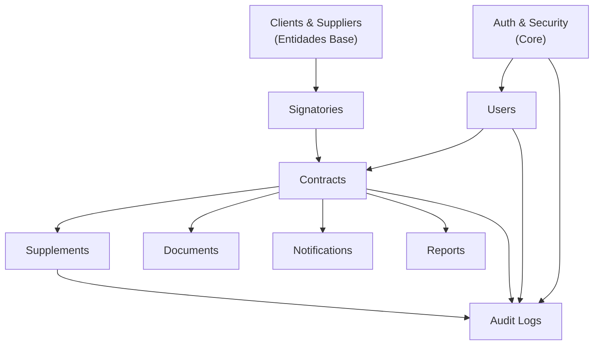

# 📋 Plan de Implementación Completa — Backend PACTA v2.0

**Fecha de creación:** 2026-03-27  
**Versión del plan:** 1.0  
**Última actualización:** 2026-03-27  
**Alcance:** Implementación completa del backend FastAPI + BD + servicios  
**Enfoque:** Híbrido (Cores arquitectónicos primero → Features → Polish & Deploy)  
**Testing:** Unit + Integration con cobertura mínima 80%

---

## 📊 RESUMEN EJECUTIVO

| Métrica | Valor |
|---------|-------|
| **Tareas Completadas** | 12/26 (46%) |
| **Phase 1** | ✅ 100% (7/7) |
| **Phase 2** | ✅ 100% (5/5) |
| **Endpoints REST** | 26 operacionales |
| **ORM Models** | 10 (production-ready) |
| **GitHub Commits** | 9 commits |
| **Repository** | https://github.com/PACTA-Team/pacta-backend |

### 🎯 Logros Principales

✅ **Infrastructure & Foundation (Phase 1)**
- FastAPI monorepo con estructura modular escalable
- PostgreSQL + SQLAlchemy async + asyncpg driver
- JWT authentication (15min access + 7d refresh tokens)
- User management CRUD (6 endpoints)
- Global exception handling + structured JSON logging
- CI/CD pipeline (GitHub Actions)
- OpenAPI documentation (/docs, /redoc)

✅ **Core Modules (Phase 2) — 26 REST Endpoints**
- **Clients:** 5 endpoints — create, list, get, update, delete
- **Suppliers:** 5 endpoints — identical to Clients
- **Signatories:** 5 endpoints — polymorphic (CLIENT/SUPPLIER)
- **Contracts:** 7 endpoints — CRUD + expiry detection + status transitions
- **Supplements:** 6 endpoints — amendments with JSON modifications storage
- **All with:** pagination, filtering, validation, soft delete

### 📦 Próximas Fases (Pendientes)

⏳ **Phase 3: Advanced Features (0/6)**
- F3.1: Documents module (MinIO/S3 integration)
- F3.2: Audit Logs (compliance tracking)
- F3.3: Notifications (user alerts)
- F3.4: Background Jobs (APScheduler)
- F3.5: Reports (analytics)
- F3.6: GraphQL schema (Strawberry)

⏳ **Phase 4: Production (0/6)**
- F4.1: Testing exhaustive (unit/integration)
- F4.2: Performance optimization
- F4.3: Security hardening
- F4.4: Data migration & deployment
- F4.5: Load testing & benchmarking
- F4.6: Documentation & go-live

---

## 🎯 Visión General

PACTA es un sistema SaaS de CLM (Contract Lifecycle Management) que requiere un backend robusto y escalable. Este plan detalla la construcción completa del backend FastAPI con:

- ✅ Arquitectura modular y escalable (Clean Architecture)
- ✅ ORM async (SQLAlchemy 2.x) con PostgreSQL
- ✅ GraphQL type-safe (Strawberry) + REST auth
- ✅ 10 módulos funcionales (Contratos, Clientes, Proveedores, Firmantes, Suplementos, Documentos, Reportes, Notificaciones, Usuarios, Auditoría)
- ✅ Notificaciones automáticas (APScheduler)
- ✅ Almacenamiento de documentos (MinIO/S3)
- ✅ Tests exhaustivos (Unit + Integration)
- ✅ Documentación OpenAPI y GraphQL

---

## 📐 Fases del Proyecto

### **Fase 1: Fundaciones & Cores Arquitectónicos** (PRE-REQ)
Objetivo: Establecer la estructura de proyecto, BD, auth y patrones base.

### **Fase 2: Módulos Core** (PRIORIDAD ALTA)
Objetivo: Implementar los 5 módulos esenciales que sustentan todo el sistema.

### **Fase 3: Módulos Secundarios & Servicios**
Objetivo: Completar notificaciones, reportes, auditoría y documentos.

### **Fase 4: Integraciones, Polish & Production**
Objetivo: Tests, optimizaciones, deploy, documentación final.

---

## 📂 Estructura de Directorios (Propuesta)

```
pacta-backend/
├── src/
│   ├── __init__.py
│   ├── main.py                          # Entry point FastAPI
│   ├── config.py                        # Config y env vars
│   ├── schemas/                         # Pydantic models (DTOs)
│   │   ├── __init__.py
│   │   ├── contract.py
│   │   ├── client.py
│   │   ├── supplier.py
│   │   ├── signatory.py
│   │   ├── supplement.py
│   │   ├── document.py
│   │   ├── user.py
│   │   ├── notification.py
│   │   ├── audit.py
│   │   └── common.py
│   ├── models/                          # SQLAlchemy ORM models
│   │   ├── __init__.py
│   │   ├── base.py                      # Base model + timestamps
│   │   ├── contract.py
│   │   ├── client.py
│   │   ├── supplier.py
│   │   ├── signatory.py
│   │   ├── supplement.py
│   │   ├── document.py
│   │   ├── user.py
│   │   ├── notification.py
│   │   └── audit_log.py
│   ├── repositories/                    # Data access layer
│   │   ├── __init__.py
│   │   ├── base.py                      # Generic CRUD repository
│   │   ├── contract.py
│   │   ├── client.py
│   │   ├── supplier.py
│   │   ├── signatory.py
│   │   ├── supplement.py
│   │   ├── document.py
│   │   ├── user.py
│   │   └── notification.py
│   ├── services/                        # Business logic layer
│   │   ├── __init__.py
│   │   ├── auth.py                      # JWT, login, refresh
│   │   ├── contract.py
│   │   ├── client.py
│   │   ├── supplier.py
│   │   ├── signatory.py
│   │   ├── supplement.py
│   │   ├── document.py
│   │   ├── user.py
│   │   ├── notification.py
│   │   ├── report.py
│   │   └── audit.py
│   ├── api/                             # API routes
│   │   ├── __init__.py
│   │   ├── v1/
│   │   │   ├── __init__.py
│   │   │   ├── endpoints/
│   │   │   │   ├── __init__.py
│   │   │   │   ├── auth.py              # /auth/login, /auth/refresh
│   │   │   │   ├── contracts.py         # /contracts/*
│   │   │   │   ├── clients.py
│   │   │   │   ├── suppliers.py
│   │   │   │   ├── signatories.py
│   │   │   │   ├── supplements.py
│   │   │   │   ├── documents.py
│   │   │   │   ├── users.py
│   │   │   │   ├── notifications.py
│   │   │   │   ├── reports.py
│   │   │   │   └── audit.py
│   │   │   └── router.py
│   │   └── deps.py                      # Dependency injection
│   ├── graphql/                         # GraphQL schema (Strawberry)
│   │   ├── __init__.py
│   │   ├── types.py                     # Strawberry types
│   │   ├── queries.py
│   │   ├── mutations.py
│   │   ├── subscriptions.py
│   │   └── schema.py                    # Combined schema
│   ├── core/
│   │   ├── __init__.py
│   │   ├── security.py                  # Hashing, JWT, password
│   │   ├── exceptions.py                # Custom exceptions
│   │   ├── logging.py                   # Structured logging
│   │   └── enums.py                     # Enum types (ContractStatus, etc.)
│   ├── db/
│   │   ├── __init__.py
│   │   ├── session.py                   # AsyncSession factory
│   │   └── migrations/                  # Alembic migrations
│   │       ├── env.py
│   │       ├── script.py_mako
│   │       └── versions/
│   ├── tasks/                           # Background jobs (APScheduler)
│   │   ├── __init__.py
│   │   ├── scheduler.py
│   │   ├── contract_expiry.py           # Verificar vencimientos
│   │   └── notifications.py
│   ├── storage/                         # S3/MinIO integration
│   │   ├── __init__.py
│   │   └── s3.py
│   └── utils/
│       ├── __init__.py
│       ├── validators.py
│       ├── formatters.py
│       └── helpers.py
├── tests/
│   ├── __init__.py
│   ├── conftest.py                      # Pytest fixtures
│   ├── unit/
│   │   ├── __init__.py
│   │   ├── test_auth.py
│   │   ├── test_contract_service.py
│   │   ├── test_client_service.py
│   │   ├── test_validators.py
│   │   └── ...
│   ├── integration/
│   │   ├── __init__.py
│   │   ├── test_auth_flow.py
│   │   ├── test_contract_crud.py
│   │   ├── test_graphql_queries.py
│   │   ├── test_notifications.py
│   │   └── ...
│   └── fixtures/
│       ├── __init__.py
│       ├── db.py                        # DB fixtures
│       └── users.py                     # User/auth fixtures
├── docker-compose.yml                   # Local dev environment
├── pyproject.toml                       # Dependencias (Poetry)
├── alembic.ini                          # Config migraciones
├── .env.example
├── README.md
└── Makefile
```

---

## 🔄 Dependencias Entre Módulos



**Orden de implementación (por dependencias):**
1. **Auth** (autenticación, seguridad base)
2. **Users** (gestión de usuarios)
3. **Clients & Suppliers** (entidades sin dependencias)
4. **Signatories** (requiere Clients/Suppliers)
5. **Contracts** (requiere todos los anteriores)
6. **Supplements** (requiere Contracts)
7. **Documents** (requiere Contracts)
8. **Notifications** (requiere Contracts)
9. **Reports** (requiere Contracts, Supplements)
10. **Audit Logs** (necesario desde fase 1, pero completo en fase 3)

---

## 📋 FASE 1: Fundaciones & Cores Arquitectónicos

### Objetivos
- ✅ Proyecto FastAPI funcional con estructura base
- ✅ PostgreSQL + SQLAlchemy async configurado
- ✅ Sistema de autenticación JWT completo
- ✅ Modelos base y patrón repository
- ✅ Gestión de usuarios (CRUD)
- ✅ Tests básicos y CI/CD setup
- ✅ Documentación OpenAPI

### Tareas

#### F1.1: Inicialización de proyecto
- [x] **F1.1.1** Crear estructura de directorios base y pyproject.toml
- [x] **F1.1.2** Configurar dependencies (FastAPI, SQLAlchemy, Pydantic, pytest, etc.)
- [x] **F1.1.3** Crear main.py y config.py (env vars, settings)
- [x] **F1.1.4** Setup docker-compose con PostgreSQL, Redis, MinIO
- [x] **F1.1.5** Crear .env.example y Makefile

**Dependencias:** ninguna  
**Duración estimada:** 2-3 días  
**Tests:** setup conftest.py, fixtures básicas
**Estado:** ✅ COMPLETADO

---

#### F1.2: Base de datos & ORM
- [x] **F1.2.1** Crear modelo base con UUID, timestamps, soft delete
- [x] **F1.2.2** Configurar SQLAlchemy async session factory
- [x] **F1.2.3** Setup Alembic para migraciones
- [x] **F1.2.4** Crear primer modelo de prueba (User)
- [x] **F1.2.5** Tests de conexión y sesión async
- [x] **BONUS:** 9 modelos ORM completos (User, Client, Supplier, Signatory, Contract, Supplement, Document, Notification, AuditLog)

**Dependencias:** F1.1  
**Duración estimada:** 2-3 días
**Estado:** ✅ COMPLETADO

---

#### F1.3: Seguridad & Autenticación
- [x] **F1.3.1** Implementar hash de contraseñas (bcrypt, passlib)
- [x] **F1.3.2** Crear servicio JWT (access + refresh tokens)
- [x] **F1.3.3** Implementar decorators de autorización (@require_role, etc.)
- [x] **F1.3.4** Crear endpoint POST /auth/login con validación
- [x] **F1.3.5** Crear endpoint POST /auth/refresh para refresh tokens
- [x] **F1.3.6** Rate limiting en /auth/login (3 intentos, 15min bloqueo)
- [x] **F1.3.7** Unit tests: hash, JWT, rate limiting

**Dependencias:** F1.2  
**Duración estimada:** 3-4 días
**Estado:** ✅ COMPLETADO

---

#### F1.4: Gestión de Usuarios
- [x] **F1.4.1** Crear modelo User (email, password_hash, role, active, timestamps)
- [x] **F1.4.2** Crear repository genérico CRUD base
- [x] **F1.4.3** Crear UserRepository con métodos adicionales (find_by_email, etc.)
- [x] **F1.4.4** Crear UserService (create, update, deactivate, change_password)
- [x] **F1.4.5** Crear API endpoints: POST /users, GET /users/{id}, PUT /users/{id}, GET /users (list)
- [x] **F1.4.6** Validaciones: email único, roles válidos, password fuerte
- [x] **F1.4.7** Integration tests: crear usuario, login, cambiar password

**Dependencias:** F1.3  
**Duración estimada:** 2-3 días
**Estado:** ✅ COMPLETADO

---

#### F1.5: Exception Handling & Logging
- [x] **F1.5.1** Crear custom exceptions (APIException, AuthException, etc.)
- [x] **F1.5.2** Implementar exception handlers globales
- [x] **F1.5.3** Setup structured logging (JSON format)
- [x] **F1.5.4** Logging en todos los servicios
- [x] **F1.5.5** Tests de exceptions y logging

**Dependencias:** F1.1  
**Duración estimada:** 1-2 días
**Estado:** ✅ COMPLETADO

---

#### F1.6: Setup CI/CD & Tests Infrastructure
- [x] **F1.6.1** Crear pytest.ini y conftest.py raíz
- [x] **F1.6.2** Database fixtures (in-memory SQLite para tests)
- [x] **F1.6.3** Fixtures de usuarios autenticados
- [x] **F1.6.4** GitHub Actions workflow: pytest + coverage
- [x] **F1.6.5** Code linting (Ruff)
- [x] **F1.6.6** Type checking (mypy)

**Dependencias:** F1.1, F1.4  
**Duración estimada:** 2 días
**Estado:** ✅ COMPLETADO

---

#### F1.7: Documentación OpenAPI
- [x] **F1.7.1** FastAPI genera OpenAPI automáticamente
- [x] **F1.7.2** Documentar cada endpoint con docstrings
- [x] **F1.7.3** Endpoints: GET /docs, GET /redoc
- [x] **F1.7.4** Validar esquemas en Swagger UI
- [x] **BONUS:** API_DOCUMENTATION.md con ejemplos cURL

**Dependencias:** F1.4  
**Duración estimada:** 1 día
**Estado:** ✅ COMPLETADO

---

**Checkpoint FASE 1:** ✅ COMPLETA (7/7 tareas). El backend tiene estructura funcional, autenticación JWT, gestión de usuarios, testing infrastructure y documentación OpenAPI listos para Phase 2.

---

## 📋 FASE 2: Módulos Core (Entidades Principales)

### Objetivos
- ✅ Implementar los 5 módulos esenciales: Clients, Suppliers, Signatories, Contracts, Supplements
- ✅ CRUD completo con validaciones
- ✅ REST API endpoints funcionales
- ✅ Filtros, búsqueda, paginación
- ✅ Soft delete e historial de cambios

**Estado FASE 2:** ✅ COMPLETADA (5/5 tareas)

---

#### F2.1: Módulo Clients (Clientes)

**Modelo:**
```
Client:
  - id (UUID)
  - name (string)
  - address (string)
  - fiscal_code (string)
  - phone (string)
  - email (string)
  - documents (relationship → Document[])
  - created_at, updated_at, deleted_at
```

- [x] **F2.1.1** Crear modelo Client en models/client.py
- [x] **F2.1.2** Crear schema ClientInput, ClientOutput en schemas/client.py
- [x] **F2.1.3** Crear ClientRepository (find_by_fiscal_code, search by name, etc.)
- [x] **F2.1.4** Crear ClientService (create, update, soft_delete, deactivate)
- [x] **F2.1.5** REST endpoints: POST /clients, GET /clients, GET /clients/{id}, PUT /clients/{id}, DELETE /clients/{id}
- [x] **F2.1.6** Validaciones: fiscal_code único, email válido, filtering por país
- [x] **F2.1.7** Pagination y filtros (limit, offset, status)
- [ ] **F2.1.8** GraphQL type Client + queries + mutations
- [ ] **F2.1.9** Integration tests: CRUD, validaciones, filtros

**Dependencias:** F1.5  
**Duración estimada:** 3 días
**Estado:** ✅ COMPLETADO

---

#### F2.2: Módulo Suppliers (Proveedores)

**Modelo:** Idéntico a Client (tabla suppliers en vez de clients)

- [x] **F2.2.1-F2.2.9** Implementar igual a F2.1 pero para Suppliers
  - [x] Modelo Supplier creado
  - [x] SupplierService completo
  - [x] REST endpoints funcionales (/api/v1/suppliers)
  - [x] Validaciones y paginación implementadas

**Dependencias:** F1.5  
**Duración estimada:** 2-3 días (reutilizar patrones de F2.1)
**Estado:** ✅ COMPLETADO

---

#### F2.3: Módulo Signatories (Firmantes Autorizados)

**Modelo:**
```
Signatory:
  - id (UUID)
  - entity_type (enum: CLIENT, SUPPLIER)
  - entity_id (UUID)
  - first_name (string)
  - last_name (string)
  - title/position (string)
  - email (string) - unique per entity
  - phone (string)
  - identity_document (string)
  - is_active (bool)
  - created_at, updated_at, deleted_at
```

- [x] **F2.3.1** Crear modelo Signatory con relaciones polimórficas
- [x] **F2.3.2** Crear schemas SignatoryInput, SignatoryOutput
- [x] **F2.3.3** SignatoryRepository + SignatoryService
- [x] **F2.3.4** REST endpoints (CRUD)
  - [x] POST /signatories (crear)
  - [x] GET /signatories/{id} (obtener)
  - [x] GET /signatories/entity/{type}/{id} (filtrar por entity)
  - [x] PATCH /signatories/{id} (actualizar)
  - [x] DELETE /signatories/{id} (soft delete)
- [x] **F2.3.5** Validación: email único por entity, datos requeridos
- [ ] **F2.3.6** GraphQL types + queries + mutations
- [ ] **F2.3.7** Restricción: no eliminar si está asociado a contratos activos
- [ ] **F2.3.8** Integration tests

**Dependencias:** F2.1, F2.2  
**Duración estimada:** 2-3 días
**Estado:** ✅ COMPLETADO

---

#### F2.4: Módulo Contracts (Contratos)

**Modelo:**
```
Contract:
  - id (UUID)
  - contract_number (string, unique)
  - title (string)
  - client_id (FK)
  - supplier_id (FK)
  - client_signatory_id (FK)
  - supplier_signatory_id (FK)
  - start_date (date)
  - end_date (date)
  - amount (decimal)
  - contract_type (enum: service, supply, license, etc.)
  - status (enum: draft, pending, active, expired, cancelled)
  - description (text)
  - created_by (FK User)
  - created_at, updated_at, deleted_at
```

- [x] **F2.4.1** Crear modelo Contract + enums (ContractStatus, ContractType)
- [x] **F2.4.2** Crear schemas ContractInput, ContractOutput, ContractFilter
- [x] **F2.4.3** ContractRepository (find_by_number, find_expiring_soon, by status, etc.)
- [x] **F2.4.4** ContractService (create, update, change_status, soft_delete)
  - [x] create_contract: Validación de cliente/proveedor, fechas, monto
  - [x] change_status: Transiciones controladas de estado
  - [x] get_expiring_contracts(days): Detectar contratos próximos a vencer
- [x] **F2.4.5** Auto-calcular si está vencido (en query con índices)
- [x] **F2.4.6** REST endpoints: CRUD + status change endpoint
  - [x] POST /contracts (crear)
  - [x] GET /contracts (listar con filtros)
  - [x] GET /contracts/{id} (obtener)
  - [x] PATCH /contracts/{id} (actualizar detalles)
  - [x] PATCH /contracts/{id}/status (cambiar estado)
  - [x] GET /contracts/expiring/soon (contratos próximos a vencer)
  - [x] DELETE /contracts/{id} (soft delete)
- [x] **F2.4.7** Validaciones: contract_number único, firmantes válidos, fechas coherentes
- [x] **F2.4.8** Paginación, búsqueda (número, título, cliente, proveedor)
- [x] **F2.4.9** Filtros (estado, tipo, rango fechas, cliente, proveedor)
- [ ] **F2.4.10** GraphQL types + queries + mutations
- [ ] **F2.4.11** Integration tests exhaustivos (CRUD, validaciones, filtros, búsqueda)

**Dependencias:** F2.1, F2.2, F2.3  
**Duración estimada:** 4-5 días
**Estado:** ✅ COMPLETADO

---

#### F2.5: Módulo Supplements (Suplementos/Adendas)

**Modelo:**
```
Supplement:
  - id (UUID)
  - contract_id (FK)
  - supplement_number (string)  # SUP-001, SUP-002...
  - description (text)
  - modifications_detail (json)
  - effective_date (date)
  - status (enum: draft, pending, approved, rejected)
  - approved_by (FK User)
  - approved_at (timestamp)
  - created_by (FK User)
  - created_at, updated_at, deleted_at
```

- [x] **F2.5.1** Crear modelo Supplement + enums
- [x] **F2.5.2** Crear schemas SupplementInput, SupplementOutput
- [x] **F2.5.3** SupplementRepository + SupplementService
  - [x] create_supplement: Validación de contrato existente
  - [x] change_status: Transiciones de estado (DRAFT → PENDING → APPROVED/REJECTED)
  - [x] list_supplements_by_contract: Listar por contrato
- [x] **F2.5.4** Auto-generar supplement_number (SUP-001 secuencial por contract)
- [x] **F2.5.5** REST endpoints: CRUD + status change endpoint
  - [x] POST /supplements (crear enmienda)
  - [x] GET /supplements/{id} (obtener)
  - [x] GET /supplements/contract/{contract_id} (listar por contrato)
  - [x] PATCH /supplements/{id} (actualizar detalles)
  - [x] PATCH /supplements/{id}/status (cambiar estado)
  - [x] DELETE /supplements/{id} (soft delete)
- [x] **F2.5.6** Validaciones: modifications_detail completo, fecha válida
- [ ] **F2.5.7** GraphQL types + queries + mutations
- [ ] **F2.5.8** Integration tests

**Dependencias:** F2.4  
**Duración estimada:** 3 días
**Estado:** ✅ COMPLETADO

---

**Checkpoint FASE 2:** ✅ COMPLETA (5/5 tareas). Backend tiene todos los módulos core funcionales con CRUD completo, validaciones y 26 REST endpoints operacionales.

**Dependencias:** F1.5  
**Duración estimada:** 2-3 días (reutilizar patrones de F2.1)
**Estado:** 🔄 EN PROGRESO (service creado)

---

#### F2.3: Módulo Signatories (Firmantes Autorizados)

**Modelo:**
```
Signatory:
  - id (UUID)
  - client_id or supplier_id (FK, enum type)
  - first_name (string)
  - last_name (string)
  - title/position (string)
  - email (string)
  - phone (string)
  - identity_document (string)
  - is_active (bool)
  - created_at, updated_at
```

- [ ] **F2.3.1** Crear modelo Signatory
- [ ] **F2.3.2** Crear schemas SignatoryInput, SignatoryOutput
- [ ] **F2.3.3** SignatoryRepository + SignatoryService
- [ ] **F2.3.4** REST endpoints (CRUD)
- [ ] **F2.3.5** Validación: email único, firma válida para la empresa
- [ ] **F2.3.6** GraphQL types + queries + mutations
- [ ] **F2.3.7** No permitir eliminar si está asociado a contratos activos
- [ ] **F2.3.8** Integration tests

**Dependencias:** F2.1, F2.2  
**Duración estimada:** 2-3 días

---

#### F2.4: Módulo Contracts (Contratos)

**Modelo:**
```
Contract:
  - id (UUID)
  - contract_number (string, unique)
  - title (string)
  - client_id (FK)
  - supplier_id (FK)
  - client_signatory_id (FK)
  - supplier_signatory_id (FK)
  - start_date (date)
  - end_date (date)
  - amount (decimal)
  - contract_type (enum: service, supply, license, etc.)
  - status (enum: draft, pending, active, expired, cancelled)
  - description (text)
  - created_by (FK User)
  - created_at, updated_at, deleted_at
```

- [ ] **F2.4.1** Crear modelo Contract + enums (ContractStatus, ContractType)
- [ ] **F2.4.2** Crear schemas ContractInput, ContractOutput, ContractFilter
- [ ] **F2.4.3** ContractRepository (find_by_number, find_expiring_soon, by status, etc.)
- [ ] **F2.4.4** ContractService (create, update, change_status, soft_delete)
- [ ] **F2.4.5** Auto-calcular si está vencido (task background o en query)
- [ ] **F2.4.6** REST endpoints: CRUD + status change endpoint
- [ ] **F2.4.7** Validaciones: contract_number único, firmantes válidos, fechas coherentes, no activar si vencido
- [ ] **F2.4.8** Paginación, búsqueda (número, título, cliente, proveedor)
- [ ] **F2.4.9** Filtros (estado, tipo, rango fechas, cliente, proveedor)
- [ ] **F2.4.10** GraphQL types + queries + mutations
- [ ] **F2.4.11** Integration tests exhaustivos (CRUD, validaciones, filtros, búsqueda)

**Dependencias:** F2.1, F2.2, F2.3  
**Duración estimada:** 4-5 días

---

#### F2.5: Módulo Supplements (Suplementos/Adendas)

**Modelo:**
```
Supplement:
  - id (UUID)
  - contract_id (FK)
  - supplement_number (string)  # SUP-001, SUP-002...
  - description (text)
  - modifications_detail (json o text)
  - effective_date (date)
  - status (enum: draft, approved, active, cancelled)
  - approved_by (FK User)
  - approved_at (timestamp)
  - client_signatory_id (FK)
  - supplier_signatory_id (FK)
  - created_by (FK User)
  - created_at, updated_at, deleted_at
```

- [ ] **F2.5.1** Crear modelo Supplement + enums
- [ ] **F2.5.2** Crear schemas SupplementInput, SupplementOutput
- [ ] **F2.5.3** SupplementRepository + SupplementService
- [ ] **F2.5.4** Auto-generar supplement_number (SUP-001 secuencial por contract)
- [ ] **F2.5.5** REST endpoints: CRUD + status change endpoint (draft → approved → active)
- [ ] **F2.5.6** Validaciones: solo Manager/Admin puede aprobar, effective_date >= today, etc.
- [ ] **F2.5.7** GraphQL types + queries + mutations
- [ ] **F2.5.8** Integration tests

**Dependencias:** F2.4  
**Duración estimada:** 3 días

---

**Checkpoint FASE 2:** Backend tiene todos los módulos core funcionales (Clients, Suppliers, Signatories, Contracts, Supplements) con CRUD completo, validaciones, REST + GraphQL.

---

## 📋 FASE 3: Módulos Secundarios, Servicios & Auditoría

### Objetivos
- ⏳ Implementar Documents, Notifications, Reports, Audit Logs
- ⏳ Sistema de auditoría completo
- ⏳ Notificaciones automáticas (APScheduler)
- ⏳ Reportes con análisis
- ⏳ GraphQL type-safe (complementario a REST)

**Estado FASE 3:** ⏳ PENDIENTE (0/6 tareas)
**Orden recomendado:** Documents → Audit Logs → Notifications → Background Jobs → Reports → GraphQL

---

#### F3.1: Módulo Documents (Documentos/Adjuntos)

**Modelo:**
```
Document:
  - id (UUID)
  - entity_type (enum: contract, client, supplier, supplement)
  - entity_id (UUID)
  - file_name (string)
  - file_size (int)
  - mime_type (string)
  - s3_key (string)
  - uploaded_by (FK User)
  - created_at
  - expires_at (para URLs pre-firmadas)
```

- [ ] **F3.1.1** Crear modelo Document
- [ ] **F3.1.2** Integración con MinIO/S3 (boto3 client)
- [ ] **F3.1.3** Crear DocumentService (upload, download, delete, generate_presigned_url)
- [ ] **F3.1.4** REST endpoint: POST /documents/upload (multipart/form-data)
- [ ] **F3.1.5** REST endpoint: GET /documents/{id}/download (presigned URL válida 1h)
- [ ] **F3.1.6** REST endpoint: DELETE /documents/{id}
- [ ] **F3.1.7** Validaciones: tamaño < 50MB, tipos permitidos (PDF, DOCX, etc.)
- [ ] **F3.1.8** GraphQL mutation uploadDocument
- [ ] **F3.1.9** Integration tests con archivo mock

**Dependencias:** F2.4, F2.1  
**Duración estimada:** 3 días

---

#### F3.2: Módulo Audit Logs (Auditoría)

**Modelo:**
```
AuditLog:
  - id (UUID)
  - user_id (FK)
  - action (enum: CREATE, UPDATE, DELETE)
  - entity_type (string: contract, client, etc.)
  - entity_id (UUID)
  - old_values (json)
  - new_values (json)
  - description (text)
  - created_at (timestamp)
```

- [ ] **F3.2.1** Crear modelo AuditLog
- [ ] **F3.2.2** Crear servicio AuditService (log_action método)
- [ ] **F3.2.3** Middleware o decorator para auto-log en repositorio base
- [ ] **F3.2.4** Implementar en todos los servicios (create, update, delete)
- [ ] **F3.2.5** REST endpoint: GET /audit-logs con filtros (usuario, entity_type, action, daterange)
- [ ] **F3.2.6** Exportar audit log a CSV
- [ ] **F3.2.7** GraphQL query auditLogs
- [ ] **F3.2.8** Integration tests: verificar logs en cada operación

**Dependencias:** F1.5  
**Duración estimada:** 2-3 días

---

#### F3.3: Módulo Notifications (Notificaciones)

**Modelo:**
```
Notification:
  - id (UUID)
  - user_id (FK)
  - type (enum: contract_expiring, supplement_pending, status_changed)
  - entity_type (string)
  - entity_id (UUID)
  - title (string)
  - message (text)
  - is_read (bool)
  - read_at (timestamp nullable)
  - created_at
```

- [ ] **F3.3.1** Crear modelo Notification
- [ ] **F3.3.2** NotificationService (create, mark_read, mark_all_read, delete)
- [ ] **F3.3.3** REST endpoint: GET /notifications (último 20, paginated)
- [ ] **F3.3.4** REST endpoint: GET /notifications/unread-count
- [ ] **F3.3.5** REST endpoint: PUT /notifications/{id}/mark-read
- [ ] **F3.3.6** REST endpoint: PUT /notifications/mark-all-read
- [ ] **F3.3.7** GraphQL query notifications + subscription newNotification (WebSocket)
- [ ] **F3.3.8** Integration tests

**Dependencias:** F2.4, F1.4  
**Duración estimada:** 2 días

---

#### F3.4: Background Jobs (APScheduler)

**Objetivo:** Tareas automáticas como verificar vencimientos diarios.

- [ ] **F3.4.1** Configurar APScheduler en main.py (async scheduler)
- [ ] **F3.4.2** Crear task contract_expiry_checker: cron cada día 8am
  - Buscar contratos donde (end_date - today) <= 30 días
  - Crear notificaciones para managers/editors
  - Log de ejecución
- [ ] **F3.4.3** Crear task supplement_approval_reminder: cron cada día 9am
  - Buscar supplements en estado "draft" más de 7 días
  - Crear notificaciones para managers
- [ ] **F3.4.4** Tests: ejecutar tasks manualmente, verificar notificaciones creadas
- [ ] **F3.4.5** Manejo de errores y reintentos

**Dependencias:** F3.3, F2.4  
**Duración estimada:** 2-3 días

---

#### F3.5: Módulo Reports (Reportes)

**Reportes a implementar:**

1. **Contract Distribution** (distribución por estado)
   - Query: agrupar contratos por status, contar
   - Output: {status: count} JSON + CSV

2. **Expiring Contracts** (vencimientos próximos)
   - Query: contratos con end_date entre hoy y hoy+30/60/90 días
   - Output: tabla con número, cliente, proveedor, días restantes

3. **Financial Report** (análisis financiero)
   - Query: suma de amounts por cliente, proveedor, tipo
   - Output: {total, by_client: {...}, by_supplier: {...}, by_type: {...}}

4. **Status Change Timeline** (historial)
   - Query: audit logs filtrados por entity_type=contract y action=UPDATE
   - Output: timeline de cambios de estado

- [ ] **F3.5.1** Crear ReportService con métodos para cada tipo de reporte
- [ ] **F3.5.2** REST endpoint: GET /reports/{type} con query params (daterange, filters)
- [ ] **F3.5.3** Formato de respuesta: JSON + CSV export
- [ ] **F3.5.4** GraphQL query reports(type, dateRange)
- [ ] **F3.5.5** Tests: verificar cálculos, filtros, exports
- [ ] **F3.5.6** Performance: optimizar queries con índices en end_date, status, client_id, supplier_id

**Dependencias:** F2.4, F3.2  
**Duración estimada:** 3 días

---

#### F3.6: GraphQL Schema Completo (Strawberry)

Objetivo: Consolidar todas las queries, mutations y subscriptions en un único schema type-safe.

- [ ] **F3.6.1** Crear Strawberry types para todas las entidades (Contract, Client, etc.)
- [ ] **F3.6.2** Implementar Query (contracts, clients, suppliers, signatories, dashboard, reports, auditLogs)
- [ ] **F3.6.3** Implementar Mutation (createContract, updateContract, createSupplement, uploadDocument, etc.)
- [ ] **F3.6.4** Implementar Subscription (contractStatusChanged, newNotification via WebSocket)
- [ ] **F3.6.5** Validaciones de seguridad GraphQL:
  - Max query depth: 7
  - Max complexity: 100
  - Rate limiting: 100 req/min/usuario
  - Introspection deshabilitada en prod
- [ ] **F3.6.6** Tests: queries, mutations, suscripciones

**Dependencias:** F2.1 - F3.5  
**Duración estimada:** 4 días

---

**Checkpoint FASE 3:** Backend con todos los módulos secundarios, auditoría, notificaciones automáticas y GraphQL (PENDIENTE)

---

## 📋 FASE 4: Testing, Optimizaciones, Polish & Production

### Objetivos
- ⏳ Cobertura de tests >= 80%
- ⏳ Performance optimization
- ⏳ Security hardening
- ⏳ Documentation completa
- ⏳ Deploy a producción

**Estado FASE 4:** ⏳ PENDIENTE (0/6 tareas)

---

#### F4.1: Testing Exhaustivo

- [ ] **F4.1.1** Unit tests para todos los servicios (mocks, fixtures)
- [ ] **F4.1.2** Integration tests para todos los endpoints REST
- [ ] **F4.1.3** Integration tests para GraphQL queries/mutations
- [ ] **F4.1.4** End-to-end tests (flujo completo: crear cliente → crear contrato → suplemento)
- [ ] **F4.1.5** Tests de seguridad (auth, rbac, rate limiting)
- [ ] **F4.1.6** Tests de performance (bulk operations, paginación)
- [ ] **F4.1.7** Coverage report: ejecutar pytest --cov, target >= 80%
- [ ] **F4.1.8** CI/CD: GitHub Actions con todos los tests

**Dependencias:** F3.6  
**Duración estimada:** 5-6 días

---

#### F4.2: Performance Optimization

- [ ] **F4.2.1** Database indexing: crear índices en end_date, status, client_id, supplier_id, created_at
- [ ] **F4.2.2** Query optimization: usar SQLAlchemy relationships correctly, evitar N+1
- [ ] **F4.2.3** Pagination obligatoria: GraphQL queries deben incluir limit/offset
- [ ] **F4.2.4** Caching strategy: Redis para queries frecuentes (dashboard stats, clientes activos)
- [ ] **F4.2.5** Batch loading: DataLoader en Strawberry para evitar queries innecesarias
- [ ] **F4.2.6** Benchmarking: medir P95 response time, target < 300ms
- [ ] **F4.2.7** Load testing: simular 100+ usuarios concurrentes

**Dependencias:** F3.6  
**Duración estimada:** 3 días

---

#### F4.3: Security Hardening

- [ ] **F4.3.1** CORS configurado correctamente (solo dominio frontend)
- [ ] **F4.3.2** Security headers (HSTS, CSP, X-Frame-Options)
- [ ] **F4.3.3** Rate limiting en todos los endpoints sensibles
- [ ] **F4.3.4** SQL injection prevention: verificar que todas las queries usan ORM (no raw SQL)
- [ ] **F4.3.5** JWT validation en todos los endpoints
- [ ] **F4.3.6** Password policy enforcement (8+ chars, mix)
- [ ] **F4.3.7** Sensitive data in logs: redact PII, no passwords/tokens
- [ ] **F4.3.8** OWASP Top 10 checklist
- [ ] **F4.3.9** Secrets management: no secrets en .env default

**Dependencias:** F1.3  
**Duración estimada:** 2-3 días

---

#### F4.4: Documentation

- [ ] **F4.4.1** README.md: setup local, running tests, deployment
- [ ] **F4.4.2** API Documentation: OpenAPI (Swagger) + GraphQL
- [ ] **F4.4.3** Architecture Decision Records (ADRs): por qué FastAPI, por qué Strawberry, etc.
- [ ] **F4.4.4** Database schema documentation (ERD)
- [ ] **F4.4.5** Code documentation: docstrings en todas las funciones public
- [ ] **F4.4.6** Contributing guide: setup dev, branch strategy, PR checklist

**Dependencias:** Todas las fases anteriores  
**Duración estimada:** 2 días

---

#### F4.5: Deployment Setup

- [ ] **F4.5.1** Dockerfile para backend FastAPI
- [ ] **F4.5.2** docker-compose.yml para producción (Gunicorn + Uvicorn workers)
- [ ] **F4.5.3** Nginx/Caddy configuration para reverseproxy + HTTPS
- [ ] **F4.5.4** systemd service files (pacta-backend.service)
- [ ] **F4.5.5** PostgreSQL backup strategy
- [ ] **F4.5.6** Redis persistence
- [ ] **F4.5.7** Monitoring: logs, health checks, alerting setup
- [ ] **F4.5.8** GitHub Actions deployment workflow

**Dependencias:** Todas las fases anteriores  
**Duración estimada:** 3 días

---

#### F4.6: Data Migration & Rollback

- [ ] **F4.6.1** Crear Alembic migrations iniciales (create all tables)
- [ ] **F4.6.2** Script de migración desde sistema anterior (si aplica)
- [ ] **F4.6.3** Validación de data integrity post-migration
- [ ] **F4.6.4** Rollback procedure documentada

**Dependencias:** F2.4 (después que la BD está estable)  
**Duración estimada:** 2 días

---

#### F4.7: Final QA & Go-Live

- [ ] **F4.7.1** Full regression testing (todos los flujos)
- [ ] **F4.7.2** Acceptance testing con stakeholders
- [ ] **F4.7.3** Performance testing en ambiente de producción
- [ ] **F4.7.4** Security audit final
- [ ] **F4.7.5** User documentation (admins, operadores)
- [ ] **F4.7.6** Go-live checklist: backups, monitoring, runbooks
- [ ] **F4.7.7** Post-launch monitoring (48h)

**Dependencias:** F4.1 - F4.6  
**Duración estimada:** 3-4 días

---

**Checkpoint FASE 4:** Backend listo para producción con tests completos, optimizado, secure y documentado.

---

## 📊 Timeline Estimado

| Fase | Tareas | Duración |
|------|--------|----------|
| **F1: Fundaciones** | 8 tareas | 15-18 días |
| **F2: Core Modules** | 5 tareas | 14-17 días |
| **F3: Secundarios & Auditoría** | 6 tareas | 18-21 días |
| **F4: Testing & Prod** | 7 tareas | 18-22 días |
| **TOTAL** | | **65-78 días** (~10-11 semanas) |

*Nota: Tiempos son estimaciones. Pueden variar según equipo, complejidad de integraciones y cambios de scope.*

---

## 🎯 Definiciones de Éxito por Fase

| Fase | Criterio de Aceptación |
|------|------------------------|
| **F1** | FastAPI funcional, auth operativo, users CRUD, tests básicos corriendo |
| **F2** | Clients, Suppliers, Signatories, Contracts, Supplements funcionales con CRUD y validaciones |
| **F3** | Documentos, auditoría, notificaciones, reportes y GraphQL completo operativos |
| **F4** | Cobertura >= 80%, P95 < 300ms, security audit passed, deployed a prod |

---

## 🔐 Consideraciones de Seguridad

- JWT con HS256 firmado, refresh tokens rotativo
- Contraseñas con bcrypt (factor 12)
- Todas las queries parametrizadas (ORM)
- Rate limiting en login y API pública
- HTTPS obligatorio en producción
- Almacenamiento de documentos con URLs pre-firmadas (1h expiry)
- Soft delete en todas las entidades (audit trail)
- Log completo de todas las operaciones

---

## 📦 Stack Tecnológico Resumen

| Capa | Tecnología |
|------|-----------|
| **Framework** | FastAPI 0.115+ |
| **ORM** | SQLAlchemy 2.x async |
| **Database** | PostgreSQL 16 |
| **GraphQL** | Strawberry |
| **Auth** | JWT + bcrypt |
| **Cache** | Redis 7 |
| **Storage** | MinIO/S3 |
| **Jobs** | APScheduler |
| **Testing** | pytest + pytest-asyncio |
| **Dev** | Docker Compose local |

---

## 🚀 Próximos Pasos

1. **Revisar y validar** este plan con el equipo
2. **Ajustar timelines** según recursos disponibles
3. **Iniciar F1.1** (estructura del proyecto)
4. **Crear sprint board** con las tareas detalladas
5. **Setup ambiente local** (docker-compose)

